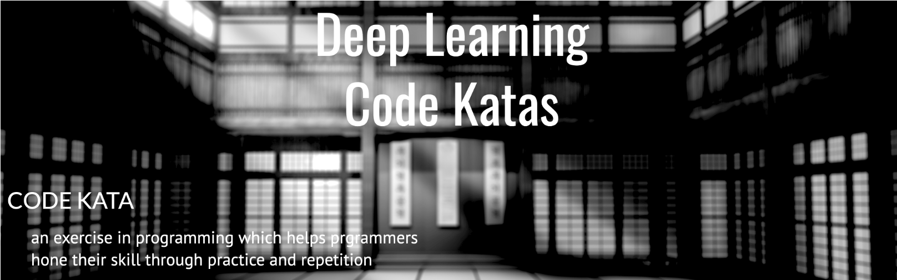

### Objective

Code Kata is defined as an **exercise** in programming which helps hone our skill through **practice and repetition**. In machine learning programming, Code Kata for implementing **ML algorithms** is very important, becuase we can realize the details ( such as Data Sampling, Weight initialization, various training strategy ...) while implementing the algorithm. 

I implement various algorithms using in **Deep Learning** and organize them into scripts.. I'll update one script each week.


> If you have a good topic, feel free to leave it on the issue! I will try to implement it as much as possible!


### How to do the Code Kada together? (set-up environment)

Do not worry! I provide the environment written as a [docker image](https://hub.docker.com/repository/docker/craftsangjae/jupyter-dojo).

````shell
# Run it From the root project directory
docker-compose up -d
````


### Deep-Learning Katas List

----

#### [Embedding Network for Handling Categorical Variables]()

**Goals**

* Implement a simple Deep Learning Model Handling variables by Embedding Layer
* Acheive Accuracy similar to that of a Random Forest Classifier

**Dataset**

* [ucl - bank marketing data set](https://archive.ics.uci.edu/ml/datasets/Bank%2BMarketing)

#### 

----

#### [Maxout Network using Tensorflow]() 

**Goals**

* Implement Maxout Activation Layer using Keras custom Layer
* Check the performance by learning fashion-MNIST

**Dataset**

* Fashion-MNIST

**papers**

* [Maxout Networks](https://arxiv.org/pdf/1302.4389.pdf)


-----

#### [two ways for visualizing CNN, guided back propagation and GradCAM]() 

**Goals**

* Implement two methods to interpret the output of CNN 

* Algorithm implementation based on the operation of Resnet50v2

**papers**

* [ Striving for Simplicity: The All Convolutional Net ](https://arxiv.org/pdf/1412.6806.pdf)

* [ Grad-CAM: Visual Explanations from Deep Networks via Gradient-based Localization](https://arxiv.org/pdf/1610.02391.pdf)


----

#### [CRNN(Text Recognition) Using Tensorflow]() <--TODO

**Goals**

* Implement CRNN, Deep Learing Model for reading text in images.

**Datasets**

* synthetic dataset using MNIST

**Papers**

* [An End-to-End Trainable Neural Network for Image-based Sequence Recognition and Its Application to Scene Text Recognition](https://arxiv.org/abs/1507.05717)


----

#### [Shake-Shake Regularization using Tensorflow]() <-- TODO

**Goals**

* Implement Shake-Shake Regularization which directly applies noise inside the Deep Learning Model

**Datasets**

* CIFAR-10

**Papers**

* [Shake-Shake Regularization](https://arxiv.org/pdf/1705.07485.pdf)

##### CopyRight [![CC BY-SA 4.0][cc-by-sa-shield]][cc-by-sa]

This repository is licensed under a [Creative Commons Attribution-ShareAlike 4.0 International License][cc-by-sa].

[![CC BY-SA 4.0][cc-by-sa-image]][cc-by-sa]

[cc-by-sa]: http://creativecommons.org/licenses/by-sa/4.0/
[cc-by-sa-image]: https://licensebuttons.net/l/by-sa/4.0/88x31.png
[cc-by-sa-shield]: https://img.shields.io/badge/License-CC%20BY--SA%204.0-lightgrey.svg


